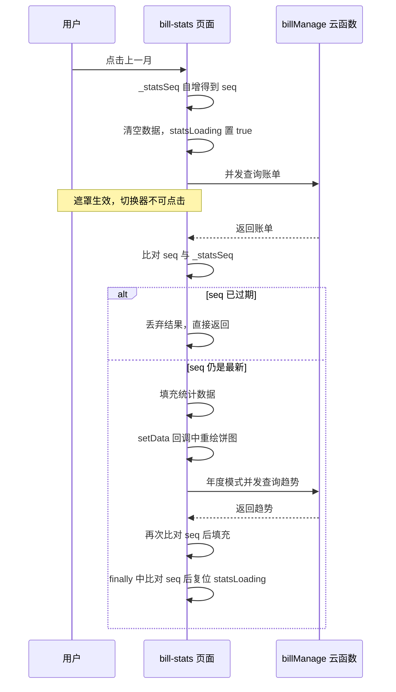

# 消费统计页数据刷新竞态修复设计

## 背景和目标

消费统计页（`pages/bill/bill-stats`）存在偶现问题：切换月份后页面数据没有更新，仍显示切换前的金额和分类占比。

本次要达成三件事：

1. 修复切换月份数据不更新的偶现问题
2. 数据加载过程中展示半透明遮罩 loading，覆盖整页含月份切换器
3. 切换时先清空上次数据，拿到新数据后再填充，避免新旧数据混杂

用户已确认两个决策：

- 遮罩范围：整页遮罩，含月份切换器。加载期间不可再次切换
- 年度模式的多次云函数调用改为并发请求

## 当前代码库现状

页面共 5 个入口会触发 `loadStats`，全部无并发保护也无防抖：

| 入口 | 触发场景 |
| --- | --- |
| `onLoad` | 页面初始加载 |
| `onSelectPayer` | 切换付款人筛选 |
| `switchPeriod` | 切换月度、年度 |
| `prevMonth` | 上一月 |
| `nextMonth` | 下一月 |

单次 `loadStats` 的云函数调用次数：

| 模式 | 主统计 | 趋势 | 合计 |
| --- | --- | --- | --- |
| 月度 | 1 次 | 6 次串行 | 7 次串行 |
| 年度 | 12 次串行 | 6 次串行 | 18 次串行 |

`loadTrends` 结果只在年度模式渲染，模板条件为 `period === 'year' && trends.length`。月度模式下这 6 次调用的结果不会被展示。

加载态现状：`loaded` 为 `false` 时整页 `stats-page` 被 `wx:if` 摘除，改为渲染全屏 `loading-view`。`onSelectPayer` 会把 `loaded` 置回 `false`，导致切换付款人时整页内容闪一下消失。

`components/loading` 组件的根节点 `.loading-page` 是 `min-height: 100vh` 的居中容器，本身不带遮罩底色，也不是 `fixed` 定位。项目中没有可复用的半透明遮罩样式类，也没有防抖或节流工具函数。

## 根因分析

切换月份数据不更新的直接原因是并发请求覆盖，属于典型的 last write wins 竞态。

`prevMonth` 更新 `currentYear` 与 `currentMonth` 后立刻调用 `loadStats`。该方法内部有 7 次到 18 次串行 `await`，整体耗时可达数秒。在这段时间内用户再次点击切换，会启动第二次 `loadStats`。两次调用共享同一个页面实例，各自在自己的 `await` 链末尾调用 `setData` 写入 `total`、`categoryStats`、`trends`。

谁最后调用 `setData` 谁就决定最终画面。云函数返回耗时不稳定，先发起的请求完全可能后返回，此时旧月份的数据会覆盖新月份的数据，表现就是切换后数据没更新。调用次数越多耗时越长，年度模式和网络较慢时复现概率显著更高，因此表现为偶现。

三个次要缺陷会放大问题：

1. `drawPieChart` 的绘制时机有问题。canvas 节点位于 `wx:if="{{categoryStats.length}}"` 内，入口清空会卸载该节点，同步绘制可能画在尚未就绪的节点上，表现为切换后饼图空白或残留旧图形
2. `drawPieChart` 读取的是 `this.data.totalStr`，在竞态下可能与传入的 `stats` 不属于同一批数据，导致圆心文案与扇形比例不一致
3. `onSelectPayer` 把 `loaded` 置回 `false`，整页内容被 `wx:if` 摘除后重新挂载，视觉上是整页闪烁

## 架构和技术设计

### 请求序号守卫

在页面实例上维护自增序号 `_statsSeq`，它不属于 `data`，避免无意义的视图层通信。

`loadStats` 入口处自增并取得本次快照序号。此后每一个 `await` 边界之后都比对序号，一旦发现 `_statsSeq` 已被后续调用推进，说明本次结果已过期，直接返回，不写 `setData`，不绘制 canvas，不进入趋势加载。

`loadTrends` 接收调用方传入的序号，在返回前做同样比对，保证晚到的趋势结果不会覆盖新数据。

这样无论并发多少次，只有最后一次发起的请求能写入页面，彻底消除 last write wins。

### 加载状态与数据清空

拆分为两个语义清晰的状态字段：

| 字段 | 语义 | 变化规则 |
| --- | --- | --- |
| `loaded` | 首屏是否已就绪 | 首次加载完成后置 `true`，此后不再回退 |
| `statsLoading` | 是否正在加载 | 每次 `loadStats` 入口置 `true`，`finally` 中单点复位 |
| `loadFailed` | 本次加载是否失败 | 入口置 `false`，`catch` 中置 `true` |

`statsLoading` 的复位收口在 `finally` 单点完成，不在成功路径中提前复位。提前复位会在剩余请求进行中放开交互，重新打开并发窗口。无 `currentPetId` 的早返回分支在 `return` 前自行复位。

引入序号守卫后，`finally` 必须先比对序号，只有最新请求才允许复位，否则过期请求会把最新请求的遮罩提前关掉。

`loadFailed` 是必需的第三个状态。若失败时只弹 toast，`total` 与 `categoryStats` 已被入口清空、`statsLoading` 又被复位，空状态条件成立，toast 淡出后页面停留在「¥0.00 加 该时段暂无消费数据」，与真实无数据无法区分。因此失败时渲染独立的失败提示并提供重试入口。

`loadStats` 入口在自增序号后立即清空上次数据，把 `totalStr`、`categoryStats`、`trends` 复位，同时置 `statsLoading` 为 `true`、`loadFailed` 为 `false`。新数据到达后再一次性填充，满足先清空再填充的要求。

`onSelectPayer` 不再操作 `loaded`，改为只更新 `selectedPayer`，加载态统一由 `loadStats` 内部管理。

空状态提示需要追加 `!statsLoading` 与 `!loadFailed` 条件。

### 整页透明遮罩

新增一个 `fixed` 定位的全屏遮罩节点，由 `statsLoading` 控制显隐，内部复用现有 `loading-view` 组件展示动效。

遮罩需要满足：

- 半透明白色底色，隐约透出下方内容，符合用户要求的透明遮罩效果
- 覆盖整页含月份切换器，加载期间点击不会穿透到下层，天然阻止重复切换
- 通过 `catchtouchmove` 阻止滚动穿透
- 使用透明度过渡，避免快速加载时遮罩生硬闪跳

两个必须遵守的约束：

1. 显隐条件是 `statsLoading && loaded`，节点写在 `wx:if="{{loaded}}"` 块之外。首屏 `loaded` 为 `false` 时已有全屏 `loading-view`，若不加 `loaded` 条件会出现两层加载动效叠加
2. 遮罩 `z-index` 取 `99`，低于 `nav-bar-inner` 的 `100`。这样月份切换器与页面内容被完全遮住，但导航栏返回按钮仍可点击。弱网年度模式加载可能持续数秒，保留退出路径比彻底锁死更安全

遮罩只阻止交互，不替代请求序号守卫。遮罩渲染存在一帧延迟，`onLoad` 与筛选切换仍可能并发，两者必须同时存在。

### 请求并发化

三处改造：

1. 年度模式的 12 个月查询由串行 `for` 改为 `Promise.all` 并发
2. 趋势的 6 个月查询同样改为 `Promise.all` 并发
3. 月度模式跳过趋势加载。趋势区块的渲染条件本就是 `period === 'year'`，月度模式下这 6 次调用的结果不会被展示

改造后的调用轮次：

| 模式 | 改造前 | 改造后 |
| --- | --- | --- |
| 月度 | 7 次串行 | 1 次 |
| 年度 | 18 次串行 | 2 轮并发，共 18 次请求 |

`Promise.all` 任一失败会整体 reject，由 `loadStats` 现有的 `catch` 统一兜底，行为与改造前的串行抛错一致。

### Canvas 绘制修复

三项改动：

1. 圆心文案与扇形角度都改为使用调用方传入的 `total` 与 `totalStr`，不再读取 `this.data`，保证两者同源
2. 扇形角度改用原始金额比例 `item.amount / total`，不再用四舍五入后的 `percent`。后者会让各扇形角度之和不等于 360 度，留下白楔或末尾扇形覆盖首个扇形
3. 绘制移到 `setData` 回调中，并在回调内再次比对序号

不需要手动 `ctx.clearRect`。旧版 canvas 的 `ctx.draw()` 默认 `reserve` 为 `false`，本次绘制前会自动清空画布。切换后的图形异常并非源于未清空，而是节点卸载重挂的时机问题。

canvas 节点的显隐由 `wx:if` 改为 `hidden`。旧版 canvas 是原生组件，节点卸载后重新挂载的就绪时机与 `setData` 回调不同步，常驻节点可以避免真机上切换后饼图空白。

## 数据流



## 关键接口与数据结构

页面实例新增字段：

```js
this._statsSeq = 0;  // 请求序号，不进入 data
```

`data` 新增字段：

```js
statsLoading: false  // 控制透明遮罩显隐
loadFailed: false    // 区分加载失败与确实无数据
```

内部方法签名：

```js
async loadStats()                                        // 内部生成并持有 seq
async loadTrends({ petId, year, month, payerOpenid }, seq) // 快照传参，不依赖调用时序
async _fetchBills({ petId, year, month, payerOpenid }, seq) // 发请求、判过期、解包三合一，过期返回 null
async _fetchBillsBatch(queries, seq)                     // 并发查询，过期返回 null
_isStale(seq)                                            // 序号比对
drawPieChart(stats, total, totalStr)                     // 比例与文案均由入参提供
onUnload()                                               // 推进序号使在途请求失效
```

`_fetchBills` 的业务失败会抛错而非降级为空数组。并发拉取有多个入口，静默降级会让用户看到偏低却看不出异常的总额。

受影响文件：

| 文件 | 改动 |
| --- | --- |
| `pages/bill/bill-stats/bill-stats.js` | 序号守卫、加载态与失败态、数据清空、请求并发化、饼图绘制修复、`onUnload` 失效标记 |
| `pages/bill/bill-stats/bill-stats.wxml` | 新增遮罩节点与失败提示，空状态追加条件，饼图卡片改用 `hidden` |
| `pages/bill/bill-stats/bill-stats.wxss` | 新增遮罩与重试按钮样式 |

云函数与数据库结构不变。

## 错误处理、兼容性和边界情况

| 场景 | 处理 |
| --- | --- |
| 请求过期 | 静默丢弃，不写 `setData`，不提示用户 |
| 云函数网络失败 | `Promise.all` 整体 reject，进入 `catch`，比对序号后置 `loadFailed` 并弹 toast |
| 云函数业务失败 | `_fetchBills` 抛错而非降级为空数组，走同一条 `catch` 路径 |
| 趋势加载失败 | `loadTrends` 自带 `catch` 只记日志，趋势卡不渲染。主统计已成功，不为次要图表再弹 toast |
| 无 `currentPetId` | 早返回，复位 `statsLoading` 与 `loadFailed` |
| 首屏加载 | `loaded` 为 `false` 时仍展示原全屏 loading，遮罩条件含 `loaded`，两者不叠加 |
| 年度模式跨年趋势 | 趋势按当前选中月份往前推 6 个月的既有逻辑不变 |
| 无数据月份 | 空状态条件含 `!statsLoading` 与 `!loadFailed`，加载结束且未失败才展示 |
| 快速连续切换 | 遮罩阻止点击，序号守卫兜底，最终画面对应最后一次有效切换 |
| 切换后立刻返回 | `onUnload` 推进序号使在途请求全部失效，不会对已卸载页面 `setData` 或弹 toast |

加载失败必须与无数据区分。失败时 `total` 与 `categoryStats` 已被入口清空、`statsLoading` 又被复位，若只弹一个 1.5 秒的 toast，淡出后页面会停留在「¥0.00 加 该时段暂无消费数据」，用户会把失败读成本月没有消费。因此引入 `loadFailed` 状态并渲染带重试入口的失败提示。

不涉及数据结构变更，无历史数据兼容问题。

## 测试策略

以微信开发者工具手动验证为主，项目当前没有单元测试框架，本次不引入。

功能验证点：

1. 月度模式连续快速点击上一月 5 次，停止后展示的金额、分类占比、分类排行与最终月份一致
2. 年度模式与月度模式来回切换 3 次，数据与当前模式一致，饼图无残留
3. 切换付款人筛选，整页不闪烁，遮罩正常出现与消失
4. 加载期间点击月份箭头与付款人标签，点击不生效
5. 切换到无账单的月份，加载结束后展示空状态，加载过程中不闪现空状态
6. 开发者工具开启弱网，验证竞态不再复现
7. 饼图圆心金额与扇形比例一致，各扇形拼合成完整圆形无白楔
8. 从有数据月份切到有数据月份，饼图正常重绘不空白
9. 加载期间导航栏返回按钮仍可点击并正常退出
10. 断网后切换月份，出现加载失败提示与重试按钮，且不显示为空数据。点击重试可恢复
11. 切换月份后立刻点返回，账单列表页不会弹出「加载失败」toast
12. 真机验证饼图。旧版 canvas 是原生组件，层级不受遮罩的 `z-index` 约束，加载期间饼图会浮在遮罩之上，属该 API 的固有限制

## 明确不做的内容

1. 不引入通用防抖或节流工具函数。序号守卫已解决正确性问题，加遮罩后重复点击已被阻止
2. 不改造其他页面的同类竞态。`bill.js`、`record.js`、`map.js` 存在相同模式，但不在本次范围
3. 不把统计聚合下沉到云函数。`billManage` 已有 `stats` action，但页面未使用，切换到该接口属于独立重构
4. 不新增缓存层
5. 不改动云函数与数据库结构
6. 不引入自动化测试框架
